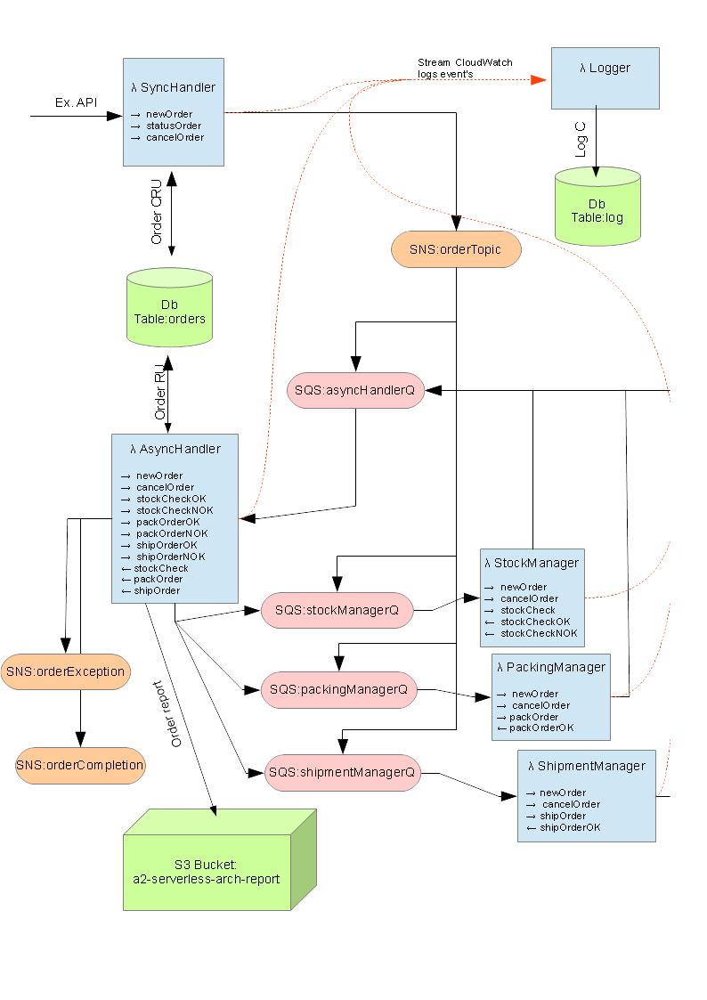
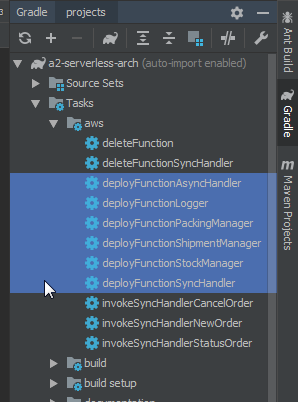
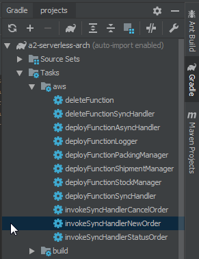
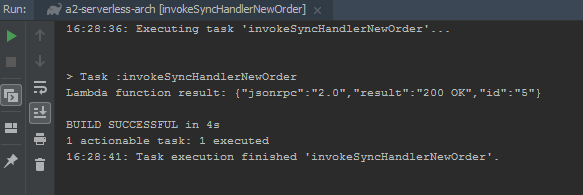

# Assignment 2 - Serverless Arch.
This is a course assignment solution for MSc. module Cloud Architecture.

## Objective
The objective of this assignment is to build an application architecture that demonstrates how serverless functions can be used to build loosely coupled systems.
Using AWS Lambda, SNS, SQS, DynamoDB and S3.

## Solution Overview
A simple stock handling solution illustrating uses of AWS Lambda, SNS (simple notification system), SQS (simple queue system), DynamoDB and S3. Written in Kotlin and deployed to AWS lambda.

(Note this is a purely educational implementation...don't build your business on it!) 



Explanation of a normal sequence of events initiated by newOrder request.
- Lambda *SyncHandler* receives asynchronous json rpc api method *newOrder*
- Lambda *SyncHandler* inserts order to db *order* table and sends '200 OK' response to api call. 
- Lambda *SyncHandler* sends *newOrder* method+data to SNS topic *orderTopic* 
- SNS topic *orderTopic* fans out message to all SQS queues 
- Lambda *AsyncHandler* processes *newOrder* and sends a *stockCheck* to SQS *stockManagerQ* (checking stock). The order status is updated in db.
- Lambda *stockManagerQ* processes *stockCheck* and returns result to SQS *AsyncHandler*. (normally *stockCheckOK*, but if orderRef/5 then *stockCheckNOK* ) 
- Lambda *AsyncHandler* processes *stockCheckOK*  and sends a *packOrder* to SQS *packingManagerQ*. The order status is updated in db.
- .. And so on until *shipOrderOK* is received by Lambda *AsyncHandler* which means order completed. 
- Lambda *AsyncHandler* writes a html report to S3 and sends notification with url to SNS topic *orderCompletion*.
- The order process is centrally logged in db *log* table. This is by streaming & filtering cloudwatch logs to Lambda Logger.  
 
## Getting Started

### Prerequisites

- An Amazon AWS account.
- Install AWS cli and configure access as follows;
```
aws configure
```
- Also recommended to use [IntelliJ IDEA](https://www.jetbrains.com/idea/)

## Deployment
### 1. Create Lambda role *a2_lambda*. 

The following role policy covers all lambda permissions required.

```
{
  "Version": "2012-10-17",
  "Statement": [
    {
      "Effect": "Allow",
      "Action": [
        "logs:CreateLogGroup",
        "logs:CreateLogStream",
        "logs:PutLogEvents",
        "s3:*",
        "sns:*",
        "sqs:*",
        "dynamodb:*"
      ],
      "Resource": "*"
    }
  ]
}
```

### 2. Deploy Lambdas

This can be performed directly from IntelliJ IDEA. Expand the Gradle drawer (on the right) and double-click each deployFunction



### 3. Deploy remaining infrastructure
You now need to create SQS, SNS and dynamo resources.

*(Relevant kotlin constants are shown which need to match strings used in cli commands. You will need to replace/set any $variables)* 

```
# 1) Create SQS Queues 
#const val SQS_STOCK_MANAGER = "stockManagerQ"
#const val SQS_PACKING_MANAGER = "packingManagerQ"
#const val SQS_SHIPMENT_MANAGER = "shipmentManagerQ"
#const val SQS_ASYNC_HANDLER = "asyncHandlerQ"

aws sqs create-queue --queue-name stockManagerQ
aws sqs create-queue --queue-name packingManagerQ
aws sqs create-queue --queue-name shipmentManagerQ
aws sqs create-queue --queue-name asyncHandlerQ

# 2) Attach SQS trigger to lambda's (lambda's created by gradle deploy functions) 
#to get SQS arn's & lambda's
aws lambda list-functions
aws sqs list-queues
aws sqs get-queue-attributes  --queue-url $queue-url --attribute-names QueueArn

#attach SQS lambda triggers
aws lambda create-event-source-mapping --event-source-arn $event-source-arn-asyncHandlerQ --function-name a2-serverless-arch-async-handler
aws lambda create-event-source-mapping --event-source-arn $event-source-arn-stockManagerQ --function-name a2-serverless-arch-stock-manager
aws lambda create-event-source-mapping --event-source-arn $event-source-arn-packingManagerQ --function-name a2-serverless-arch-packing-manager
aws lambda create-event-source-mapping --event-source-arn $event-source-arn-shipmentManagerQ --function-name a2-serverless-arch-shipment-manager


# 3) Create DynamoDb tables
#const val ORDER_TABLE = "order"
#const val LOG_TABLE = "log"

aws dynamodb create-table --table-name order --attribute-definitions AttributeName=orderRef,AttributeType=S  --key-schema AttributeName=orderRef,KeyType=HASH --provisioned-throughput ReadCapacityUnits=5,WriteCapacityUnits=5
aws dynamodb create-table --table-name log --attribute-definitions AttributeName=id,AttributeType=S  --key-schema AttributeName=id,KeyType=HASH --provisioned-throughput ReadCapacityUnits=5,WriteCapacityUnits=5

# 4) Create SNS topics and subscriptions 
#const val SNS_EXCEPTION_TOPIC = "orderException"
#const val SNS_COMPLETION_TOPIC = "orderCompletion"
#const val SNS_ORDER_TOPIC = "orderTopic"

aws sns create-topic --name orderException
aws sns create-topic --name orderCompletion
aws sns create-topic --name orderTopic

# Add SQS subscription's for orderTopic
aws sns subscribe --topic-arn $topic-arn-orderTopic --protocol sqs --notification-endpoint  $aws-arn-asyncHandlerQ  --attributes RawMessageDelivery=true
aws sns subscribe --topic-arn $topic-arn-orderTopic --protocol sqs --notification-endpoint  $aws-arn-packingManagerQ  --attributes RawMessageDelivery=true
aws sns subscribe --topic-arn $topic-arn-orderTopic --protocol sqs --notification-endpoint  $aws-arn-stockManagerQ  --attributes RawMessageDelivery=true
aws sns subscribe --topic-arn $topic-arn-orderTopic --protocol sqs --notification-endpoint  $aws-arn-shipmentManagerQ  --attributes RawMessageDelivery=true

# Add email subscription's for orderCompletion
aws sns subscribe --topic-arn $topic-arn-orderCompletion --protocol email --notification-endpoint $orderCompletion-email-address

# Add email subscription's for orderException
aws sns subscribe --topic-arn $topic-arn-orderException --protocol email --notification-endpoint $orderException-email-address


5) Cloudwatch Log subscriptions with filter pattern must be manually created
#const val LOG_PREFIX="[LOG]" 

#list log groups 
aws logs describe-log-groups

aws logs put-subscription-filter --log-group-name $lambda-arn-sync-handler --filter-name  LambdaStream_a2-serverless-arch-logger --filter-pattern "\"[LOG]\"" --destination-arn $lambda-arn-logger 
aws logs put-subscription-filter --log-group-name $lambda-arn-async-handler --filter-name  LambdaStream_a2-serverless-arch-logger --filter-pattern "\"[LOG]\"" --destination-arn $lambda-arn-logger
aws logs put-subscription-filter --log-group-name $lambda-arn-shipment-manager --filter-name  LambdaStream_a2-serverless-arch-logger --filter-pattern "\"[LOG]\"" --destination-arn $lambda-arn-logger
aws logs put-subscription-filter --log-group-name $lambda-arn-stock-manager --filter-name  LambdaStream_a2-serverless-arch-logger --filter-pattern "\"[LOG]\"" --destination-arn $lambda-arn-logger
aws logs put-subscription-filter --log-group-name $lambda-arn-packing-manager --filter-name  LambdaStream_a2-serverless-arch-logger --filter-pattern "\"[LOG]\"" --destination-arn $lambda-arn-logger

6) Create S3 Bucket 
#const val S3_REPORT_BUCKET="a2-serverless-arch-report"

aws s3 mb s3://a2-serverless-arch-report
 
```

## Invocation
JSON RPC examples can be found in folder ./test/resources/. 

You can execute by pasting JSON payload from files to aws cli as follows; 

```
aws lambda invoke --function-name a2-serverless-arch-sync-handler --payload '$paste_payload_here' output.txt
cat output.txt
```
 
...but much easier just to invoke from IDE 






## Authors
K.Brennan

## License
This project is licensed under the MIT License 


